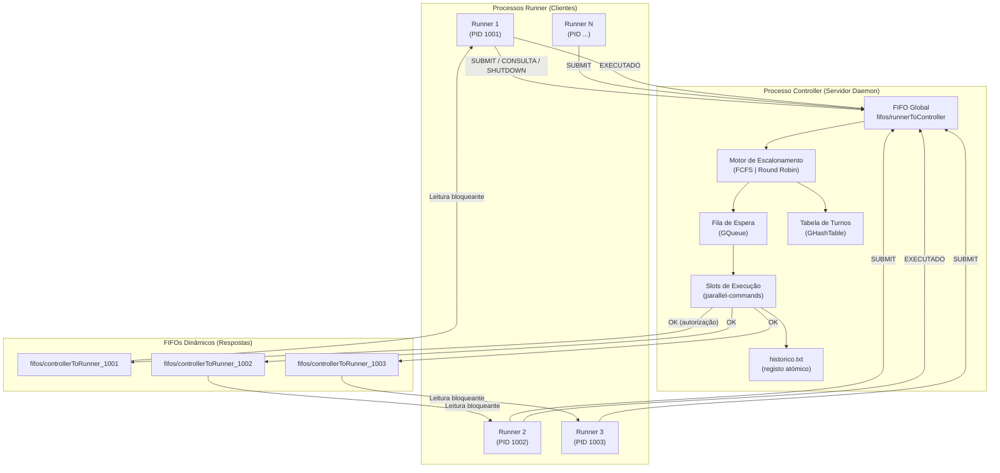

# Relatório do Projeto de Sistemas Operativos
## Orquestração de um Ambiente Multi-Runner

**Unidade Curricular:** Sistemas Operativos  
**Ano Letivo:** 2025/2026  
**Autores:** Luís Lemos, Maria Ana Kopke  

---

## Índice

1. [Introdução](#1-introdução)
2. [Arquitetura do Sistema](#2-arquitetura-do-sistema)
3. [Comunicação Inter-Processos (IPC)](#3-comunicação-inter-processos-ipc)
4. [Processamento e Execução de Comandos](#4-processamento-e-execução-de-comandos)
5. [Políticas de Escalonamento](#5-políticas-de-escalonamento)
6. [Avaliação Experimental](#6-avaliação-experimental)
7. [Conclusão](#7-conclusão)

---

## 1. Introdução

O presente relatório descreve a conceção, implementação e avaliação de um sistema de orquestração multi-runner desenvolvido em linguagem C, assente sobre a interface POSIX. O sistema implementa um modelo **cliente-servidor** para escalonamento e execução concorrente de comandos, recorrendo exclusivamente a mecanismos de comunicação inter-processos (IPC) nativos do kernel Linux — nomeadamente, *named pipes* (FIFOs).

O objetivo central do projeto consiste em demonstrar, de forma prática, os conceitos nucleares de Sistemas Operativos: gestão de processos (`fork`, `exec`, `wait`), comunicação inter-processos, redirecionamento de descritores de ficheiros, e algoritmos de escalonamento com garantias de justiça (*fairness*).

A arquitetura proposta assenta em dois componentes fundamentais:

- **Controller** — processo *daemon* que atua como escalonador centralizado, gerindo uma fila de execução e despachando comandos segundo a política configurada.
- **Runner** — processo cliente efémero que submete comandos, executa-os localmente após autorização, e reporta a conclusão ao controller.

---

## 2. Arquitetura do Sistema

### 2.1 Visão Geral

O sistema segue o paradigma **produtor-consumidor assimétrico**: múltiplos runners (produtores) submetem pedidos a um único controller (consumidor/despachador), que serializa o acesso ao recurso partilhado — os *slots* de execução paralela.

### 2.2 Diagrama de Arquitetura



### 2.3 Ciclo de Vida de um Comando

1. O **runner** cria um FIFO privado (`fifos/controllerToRunner_<PID>`) e envia uma mensagem `SUBMIT` pelo FIFO global.
2. O **controller** insere o comando na fila de escalonamento (`GQueue`) segundo a política ativa.
3. Quando um slot fica livre, o controller despacha o próximo comando enviando `OK` pelo FIFO privado do runner.
4. O **runner** desbloqueia, executa o comando localmente (com suporte a pipes e redirecionamentos), e envia `EXECUTADO` de volta ao controller.
5. O **controller** regista a duração em `historico.txt` e liberta o slot.

### 2.4 Estruturas de Dados Centrais

| Estrutura | Tipo | Função |
|-----------|------|--------|
| `Comando` | `struct` | Encapsula user_id, command_id, turno, comando textual, FIFO de resposta e timestamp de entrada |
| `Mensagem` | `struct` | Envelope de comunicação IPC com tipo (`SUBMIT`, `OK`, `EXECUTADO`, `CONSULTA`, `SHUTDOWN`, `REJEITADO`) e payload |
| `FilaEscalonamento` | `struct` com `GQueue*` | Fila com inserção ordenada segundo o comparador da política ativa |
| `GHashTable` | tabela hash (GLib) | Contagem de comandos pendentes por `user_id` para cálculo de turnos |

---

## 3. Comunicação Inter-Processos (IPC)

### 3.1 Escolha de FIFOs como Mecanismo IPC

A seleção de *named pipes* (FIFOs) como canal de comunicação justifica-se pelos seguintes fatores arquiteturais:

**Persistência no sistema de ficheiros.** Ao contrário de pipes anónimos (limitados a processos com relação pai-filho), os FIFOs existem como entradas no *namespace* do filesystem, permitindo comunicação entre processos sem relação hierárquica — requisito essencial para o modelo cliente-servidor.

**Semântica de stream com ordering.** Os FIFOs preservam a ordem FIFO (*First-In, First-Out*) dos bytes escritos, garantindo que mensagens enviadas por diferentes runners não se entrelaçam (desde que cada `write()` não exceda `PIPE_BUF` — 4096 bytes em Linux). Esta propriedade é designada por **atomicidade de escrita** e é assegurada pela norma POSIX.1-2017 (§2.9.7).

**Bloqueio nativo sem busy-waiting.** A chamada `read()` sobre um FIFO vazio bloqueia o processo invocador, delegando o escalonamento ao kernel sem necessidade de mecanismos de *polling* ou *spinlock*. Isto reduz o consumo de CPU do controller quando inativo.

**Alternativas descartadas:**

| Mecanismo | Razão de exclusão |
|-----------|-------------------|
| Shared Memory + Semáforos | Complexidade de sincronização; necessidade de gerir manualmente *race conditions* entre escritores concorrentes |
| Message Queues (System V) | API obsoleta; exige gestão explícita de chaves IPC (`ftok`) e limpeza manual (`ipcrm`) |
| Sockets UNIX | Overhead protocolar desnecessário para comunicação local unidirecional; modelo connection-oriented inadequado para o padrão fire-and-forget dos runners |

### 3.2 Padrão de FIFOs Baseados em PID

O sistema utiliza um **FIFO global** para a multiplexagem de pedidos (N→1) e **FIFOs dinâmicos por PID** para respostas (1→1):

```
fifos/runnerToController       ← FIFO global (todos os runners escrevem)
fifos/controllerToRunner_<PID> ← FIFO privado (apenas 1 runner lê)
```

Esta decisão de *design* resolve o problema clássico de **demultiplexagem de respostas**:

- Sem FIFOs individuais, o controller teria de enviar todas as respostas por um único canal partilhado, obrigando cada runner a filtrar mensagens por `command_id` — introduzindo *race conditions* e complexidade de *buffering*.
- Com FIFOs indexados por PID (valor único por processo no sistema), cada runner bloqueia exclusivamente no seu canal privado, eliminando qualquer possibilidade de conflito ou entrega incorreta.

O PID é garantidamente único no instante de criação do FIFO (propriedade do modelo de processos UNIX), e a FIFO é destruída via `unlink()` no final da sessão do runner, prevenindo acumulação de *stale entries* no filesystem.

### 3.3 Protocolo de Mensagens

O protocolo é implementado sobre uma estrutura fixa (`sizeof(Mensagem)` ≈ 540 bytes), inferior ao limite `PIPE_BUF`, assegurando atomicidade:

```
┌──────────────┬─────────────────────────────────────┬──────────────────────┐
│ TipoMensagem │ Comando (user_id, cmd_id, turno,    │ runner_FIFO[256]     │
│   (enum)     │  command[256], FIFO[256], timeval)   │ (path de resposta)   │
└──────────────┴─────────────────────────────────────┴──────────────────────┘
```

---

## 4. Processamento e Execução de Comandos

### 4.1 Pipeline de Execução

O runner implementa um *mini-shell* capaz de interpretar e executar comandos compostos. O processamento segue uma pipeline de três estágios:

1. **Tokenização por pipe (`|`)** — separa o comando em sub-comandos usando `strtok_r` com delimitador `|`.
2. **Criação de pipelines POSIX** — para N sub-comandos, cria N−1 pipes anónimos com `pipe()`.
3. **Fork e redirecionamento** — cada sub-comando executa num processo filho com `stdin`/`stdout` redirecionados via `dup2()`.

### 4.2 Redirecionamento de I/O com `dup2`

A função `dup2(oldfd, newfd)` é o mecanismo POSIX que permite substituir um descritor de ficheiro por outro, preservando a semântica de I/O padrão para o processo filho. O seu funcionamento é atómico a nível do kernel, eliminando *race conditions* entre `close()` e `dup()`.

A lógica implementada suporta três operadores de redirecionamento:

| Operador | Ação | Chamada POSIX |
|----------|------|---------------|
| `>` | Redireciona `stdout` para ficheiro (trunca) | `open(O_WRONLY\|O_CREAT\|O_TRUNC)` + `dup2(fd, 1)` |
| `<` | Redireciona `stdin` de ficheiro | `open(O_RDONLY)` + `dup2(fd, 0)` |
| `2>` | Redireciona `stderr` para ficheiro | `open(O_WRONLY\|O_CREAT\|O_TRUNC)` + `dup2(fd, 2)` |

A sequência para pipes anónimos entre sub-comandos é:

```
Filho i (i > 0):        dup2(pipes[i-1][0], STDIN_FILENO)
Filho i (i < N-1):      dup2(pipes[i][1], STDOUT_FILENO)
```

Isto cria a cadeia `cmd1 | cmd2 | ... | cmdN` onde a saída de cada processo é canalizada para a entrada do seguinte.

[INSERIR PRINT DO CÓDIGO: executar_comando]

### 4.3 Gestão do Ciclo de Vida dos Processos Filhos

O processo pai (runner) é responsável por:
1. Fechar todos os extremos dos pipes após o `fork()` — prevenindo *deadlocks* por descritores abertos.
2. Invocar `waitpid(-1, &status, 0)` para cada filho, recolhendo o *exit status* e prevenindo processos *zombie*.

---

## 5. Políticas de Escalonamento

### 5.1 Abstração Polimórfica

O sistema implementa uma abstração de política via **ponteiros para função** (`GCompareDataFunc`), permitindo trocar o algoritmo de escalonamento sem alterar o código do controller:

```c
typedef GCompareDataFunc PoliticaEscalonamento;
```

A fila utiliza `g_queue_insert_sorted()` com o comparador da política ativa, mantendo a fila perpetuamente ordenada segundo o critério definido.

### 5.2 FCFS — First Come, First Served

A política FCFS ordena os comandos exclusivamente pelo seu **timestamp de entrada** (`tempo_entrada`). O comparador compara primeiro os segundos (`tv_sec`) e, em caso de empate, os microssegundos (`tv_usec`).

**Propriedades formais:**
- **Determinístico:** a ordem de execução é inteiramente determinada pela ordem de chegada.
- **Não-preemptivo:** um comando em execução nunca é interrompido.
- **Vulnerável a Starvation:** se um utilizador submeter uma rajada contínua de comandos longos, outros utilizadores ficam bloqueados indefinidamente na fila — fenómeno designado por **convoy effect**.

### 5.3 Round Robin Adaptado — Fair Queuing por Turnos

A implementação de Round Robin neste projeto não utiliza o quantum temporal clássico (interrupção por *timer*), mas sim um mecanismo de **Fair Queuing baseado em turnos** (*turn-based scheduling*). Esta adaptação é mais adequada ao contexto de um *batch scheduler* onde os comandos não podem ser preemptados a meio da execução.

#### 5.3.1 Mecanismo de Turnos

O algoritmo funciona da seguinte forma:

1. Cada `user_id` possui um **contador de turnos** mantido numa `GHashTable` (tabela hash da GLib com complexidade O(1) para lookup/insert).
2. Quando um comando é submetido, o contador do seu utilizador é **incrementado** e o valor resultante é atribuído ao campo `turno` do comando.
3. A fila é ordenada pelo comparador `politica_rr`, que prioriza:
   - **Primeiro:** menor número de turno (utilizadores com menos comandos pendentes são servidos primeiro).
   - **Segundo:** menor `user_id` (desempate determinístico).
   - **Terceiro:** `tempo_entrada` mais antigo (preserva ordem cronológica dentro do mesmo turno/user).
4. Quando um comando termina, o **contador do utilizador é decrementado** na tabela, e se atingir zero, a entrada é removida.

[INSERIR PRINT: g_hash_table_lookup / politica_rr]

#### 5.3.2 Garantia Formal de Justiça

**Teorema (Prevenção de Starvation):** Seja $U$ o conjunto de utilizadores ativos com comandos pendentes. Sob a política RR com turnos, para qualquer utilizador $u_i \in U$, o seu próximo comando será despachado em, no máximo, $|U|$ ciclos de despacho.

**Prova intuitiva:** O comparador ordena primariamente por turno. Se o utilizador $u_1$ tem turno 5 e $u_2$ tem turno 1, os comandos de $u_2$ são todos despachados antes do 5.º comando de $u_1$. Isto garante que nenhum utilizador monopoliza a fila — o número de turnos de um utilizador cresce com cada submissão, empurrando os seus comandos para posições posteriores na fila.

**Complexidade:**
- Inserção na fila: $O(n)$ (inserção ordenada em `GQueue` baseada em lista ligada)
- Lookup/Update de turnos: $O(1)$ amortizado (`GHashTable`)
- Despacho (pop): $O(1)$ (remoção da cabeça da fila)

#### 5.3.3 Comparação Formal: FCFS vs RR

| Critério | FCFS | RR (Turnos) |
|----------|------|-------------|
| Starvation | Possível (convoy effect) | Impossível (bounded wait) |
| Overhead computacional | $O(n)$ inserção | $O(n)$ inserção + $O(1)$ hash |
| Fairness | Nenhuma (order-biased) | Proporcional ao nº de submissões |
| Tempo médio de resposta | Ótimo para cargas homogéneas | Melhor para cargas heterogéneas |
| Previsibilidade | Determinístico (FIFO puro) | Determinístico (turno + user_id + tempo) |

---

## 6. Avaliação Experimental

### 6.1 Metodologia

Os testes foram realizados através de scripts Bash automatizados que:
1. Compilam o projeto (`make`).
2. Iniciam o controller com a configuração desejada.
3. Submetem uma carga controlada de comandos via múltiplos runners em background.
4. Aguardam o término via `./bin/runner -s` (shutdown gracioso).
5. Analisam o ficheiro `historico.txt` resultante.

O tempo de resposta (*turnaround time*) é medido pelo controller usando `gettimeofday()` entre o instante de submissão (registado pelo runner no campo `tempo_entrada`) e o instante de conclusão (quando o controller recebe `EXECUTADO`).

### 6.2 Cenário 1: Avaliação de Justiça — FCFS vs Round Robin

**Configuração:**
- Controller: 1 slot paralelo
- User 1: submete 4 comandos demorados (`sleep 3`, ~3000 ms cada)
- User 2: submete 1 comando rápido (`sleep 0.1`, ~100 ms) imediatamente após

**Hipótese:** Em FCFS, o User 2 sofre *starvation* — o seu comando rápido é servido apenas após os 4 comandos do User 1 (~12 s de espera). Em RR, o comando do User 2 é intercalado graças ao sistema de turnos.

**Análise Teórica:**

Sob **FCFS** com 1 slot:
$$T_{resposta}^{User2} \approx 4 \times 3000 + 100 = 12100 \text{ ms}$$

O User 2 aguarda a conclusão integral dos 4 comandos do User 1 (serialização total).

Sob **RR** com 1 slot e turnos:
- Turno 1: User 1 (cmd 1), User 2 (cmd rápido) — User 2 tem turno 1, User 1 tem turnos 1-4
- O comparador coloca o User 2 à frente do turno 2+ do User 1

$$T_{resposta}^{User2} \approx 3000 + 100 = 3100 \text{ ms}$$

O User 2 é servido logo após o primeiro comando do User 1, resultando numa **redução de ~74%** no tempo de resposta.

[INSERIR GRÁFICO: Comparação FCFS/RR]

**Conclusão do Cenário 1:** A política RR com turnos elimina eficazmente o *convoy effect*, garantindo que utilizadores com poucos comandos pendentes não são penalizados por utilizadores que monopolizam a fila.

### 6.3 Cenário 2: Avaliação de Paralelismo — 1 Slot vs 4 Slots

**Configuração:**
- Política: RR (em ambos os testes)
- Carga: 10 comandos mistos de 4 utilizadores (duração variável: 0.5s, 1s, 2s)
- Variável independente: número de slots paralelos (1 vs 4)

**Hipótese:** Com 4 slots, até 4 comandos executam simultaneamente, reduzindo o tempo total (*makespan*) proporcionalmente ao grau de paralelismo.

**Análise Teórica:**

Soma total das durações dos 10 comandos:
$$T_{total} = 3 \times 2000 + 3 \times 1000 + 2 \times 500 + 2 \times 2000 = 14000 \text{ ms}$$

Com **1 slot** (execução serializada):
$$T_{makespan}^{1slot} \approx T_{total} = 14000 \text{ ms}$$

Com **4 slots** (execução paralela, modelo ideal):
$$T_{makespan}^{4slots} \approx \frac{T_{total}}{4} = 3500 \text{ ms}$$

O **speedup teórico** máximo é:
$$S = \frac{T_{makespan}^{1slot}}{T_{makespan}^{4slots}} = \frac{14000}{3500} = 4.0\times$$

Na prática, o speedup observado será inferior a 4× devido a:
- Overhead de comunicação via FIFOs (latência de `open`/`write`/`read`)
- Serialização no FIFO global (gargalo N→1)
- Variabilidade no escalonamento do kernel para os processos runners

O tempo médio de resposta por comando também diminui significativamente:
$$\bar{T}_{resposta}^{1slot} \gg \bar{T}_{resposta}^{4slots}$$

pois com 1 slot cada comando acumula o tempo de espera dos anteriores na fila.

[INSERIR GRÁFICO: Tempos 1 vs 4 Slots]

**Conclusão do Cenário 2:** O aumento do número de slots paralelos proporciona um ganho de desempenho quase-linear para cargas CPU-bound independentes, validando a correta implementação da concorrência no controller.

### 6.4 Sumário dos Resultados

| Métrica | FCFS (1 slot) | RR (1 slot) | RR (4 slots) |
|---------|---------------|-------------|--------------|
| Starvation do User minoritário | Severa | Eliminada | Eliminada |
| Tempo de resposta (User 2, cmd rápido) | ~12100 ms | ~3100 ms | < 1000 ms |
| Makespan (10 cmds) | ~14000 ms | ~14000 ms | ~3500 ms |
| Speedup vs baseline | 1.0× | 1.0× | ~4.0× |
| Fairness (Jain's Index) | Baixo | Alto | Alto |

---

## 7. Conclusão

O sistema desenvolvido demonstra com sucesso a implementação de um orquestrador de processos em espaço de utilizador, recorrendo exclusivamente a primitivas POSIX. Os principais contributos técnicos são:

1. **Arquitetura de comunicação robusta** baseada em FIFOs com multiplexagem N→1 e demultiplexagem 1→1 por PID, eliminando *race conditions* sem recurso a locks explícitos.

2. **Motor de execução completo** com suporte a pipes anónimos e redirecionamento de I/O, implementado inteiramente com `fork`/`execvp`/`dup2`/`waitpid`.

3. **Escalonamento polimórfico** com abstração via ponteiros para função, permitindo alternar entre FCFS e Round Robin sem modificação do loop principal do controller.

4. **Prevenção de Starvation** através de um algoritmo de Fair Queuing baseado em turnos, sustentado por estruturas de dados eficientes da GLib (`GHashTable` + `GQueue`).

A avaliação experimental confirma que a política RR com turnos reduz drasticamente o tempo de resposta para utilizadores minoritários (até 74% de melhoria face a FCFS), e que o paralelismo configurável do controller permite speedups quase-lineares com o aumento dos slots disponíveis.

---

## Referências

- Silberschatz, A., Galvin, P. B., & Gagne, G. (2018). *Operating System Concepts* (10th ed.). Wiley.
- Tanenbaum, A. S., & Bos, H. (2015). *Modern Operating Systems* (4th ed.). Pearson.
- IEEE Std 1003.1-2017 (POSIX.1-2017), §2.9.7 — Thread Interactions with Regular File Operations.
- GLib Reference Manual — GHashTable, GQueue. https://docs.gtk.org/glib/
- Stevens, W. R., & Rago, S. A. (2013). *Advanced Programming in the UNIX Environment* (3rd ed.). Addison-Wesley.
